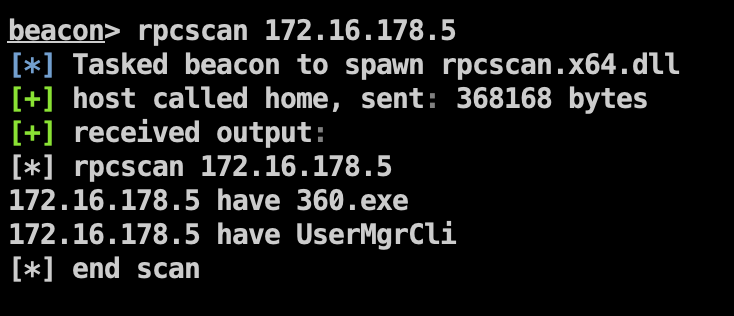
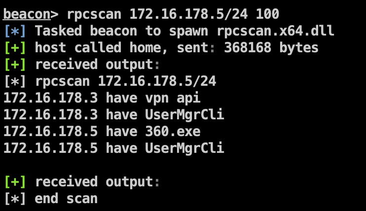

# RPCSCAN

RPC远程主机信息匿名扫描工具。通过此工具，能在没有帐号密码的情况下，获取远程主机的RPC映射图，通过uuid来匹配相关进程达到主机信息收集的目的。（当前支持360.exe和VPN api的探测，后续将继续添加更多的程序支持）

## Install

将rpcscan.dll和rpcscan.cna放同一个目录，后用CS导入CNA即可

## Usage

```
beacon> ? rpcscan
Use: rpcscan [ips] [thread num]

rpc info scan and get process
```

扫描单ip：`rpcscan 172.16.178.5`



100线程扫描172.16.178.5的C段：`rpcscan 172.16.178.5/24 100`



